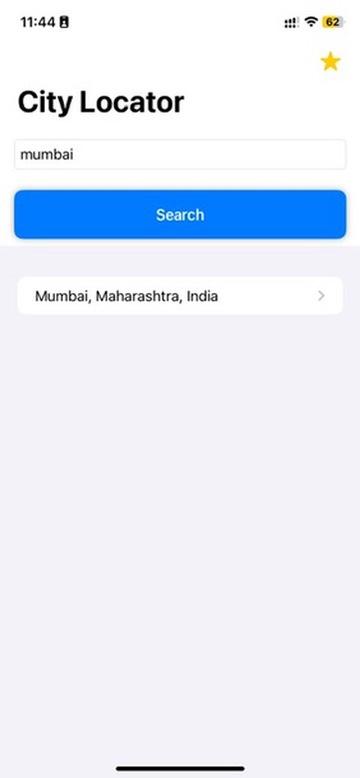
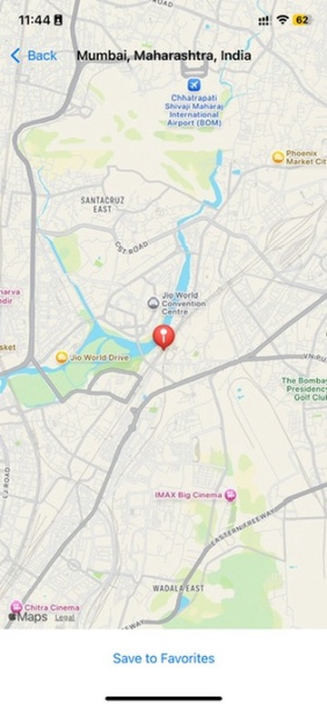
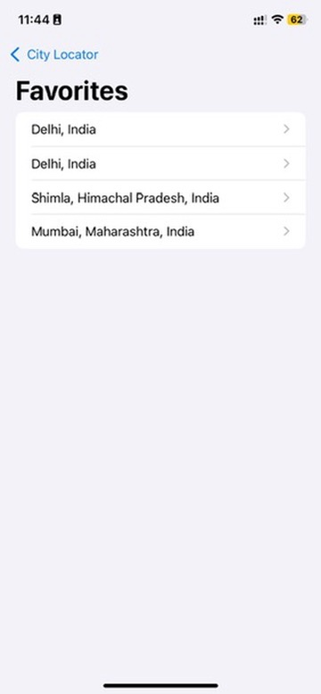

# 📱 City Locator App – iOS Final Exam

This is a SwiftUI-based app that allows users to search for cities, view them on a map, and save favorites using Core Data.

## 🖼️ Screenshots

<table>
  <tr>
    <td></td>
    <td></td>
    <td></td>
    <td></td>
  </tr>
</table>

## 📦 Features
- 🔍 Search for cities using Nominatim API
- 🗺️ View locations on a full-screen map with MapKit
- ⭐ Save favorite places with Core Data
- 📋 View and navigate to saved places

---

✅ **Built with SwiftUI • MapKit • Core Data**
